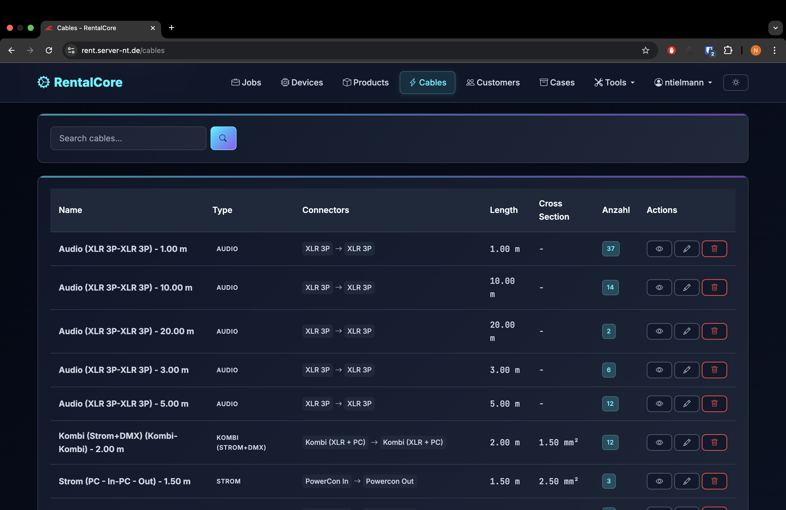
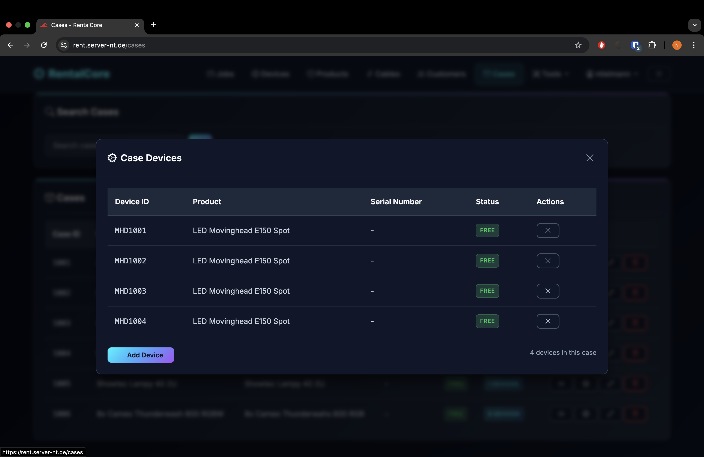
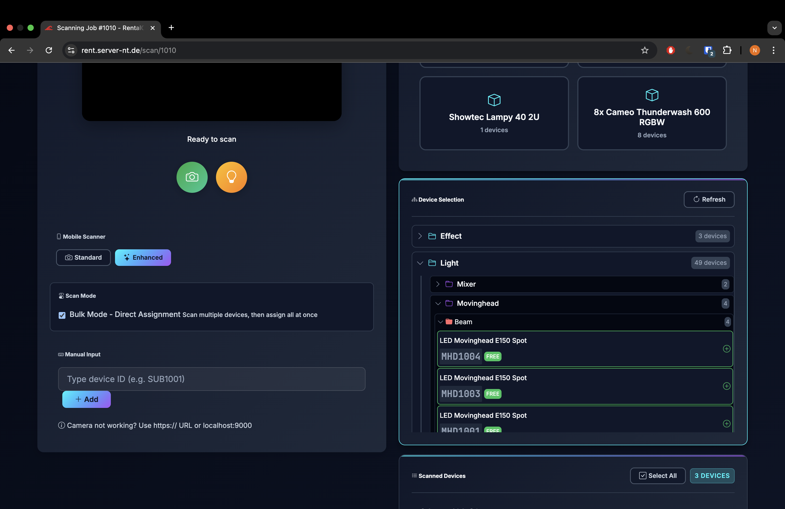
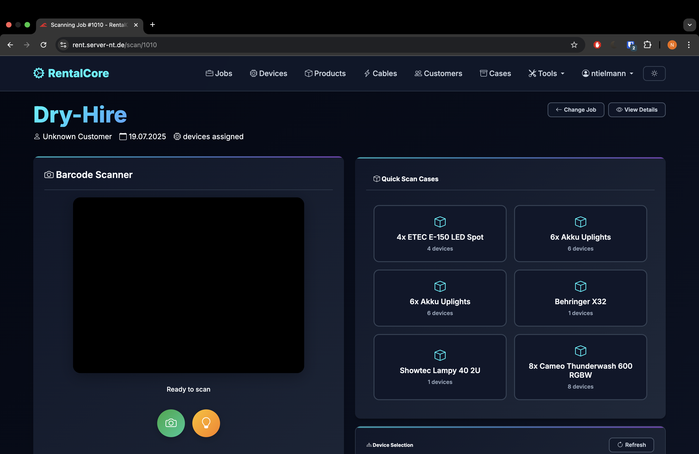

# 🎯 RentalCore - Professional Equipment Rental Management System

A comprehensive, enterprise-grade equipment rental management system built with Go, featuring advanced analytics, device tracking, and customer management. Designed for exclusive Docker deployment with professional theming and modern web interface.

## 📑 Table of Contents

- [✨ Key Features](#-key-features)
- [🚀 Quick Start](#-quick-start-docker-deployment)
- [🏗️ Project Architecture](#️-project-architecture)
- [🔧 Configuration](#-configuration-management)
- [📊 API Documentation](#-api-documentation)
- [🔐 Security](#-security-features)
- [🚀 Deployment](#-production-deployment)
- [📈 Performance](#-performance--scaling)
- [🛠️ Development](#️-development)
- [📝 Documentation](#-documentation)
- [📱 Responsive Design](#-responsive-design)
- [📷 Demo Images](#-demo-images)
- [🏷️ Version History](#️-version-history)
- [📧 Support](#-support--contact)

## ✨ Key Features

### 📊 **Advanced Analytics Dashboard**
- **Real-time Analytics**: Revenue trends, equipment utilization, customer metrics
- **Interactive Charts**: Chart.js integration with responsive visualizations  
- **Device Analytics**: Individual device performance with detailed insights modal
- **Time Period Filtering**: 7 days, 30 days, 90 days, 1 year analysis
- **Export Functionality**: PDF and CSV export with UTF-8 encoding
- **Performance Metrics**: Utilization rates, booking statistics, revenue analysis

### 🏢 **Equipment Management**
- **Device Inventory**: Complete equipment tracking with categories and products
- **Availability Tracking**: Real-time device status (available, checked out, maintenance)
- **QR Code & Barcode Generation**: Automated code generation for device identification
- **🆕 Scan-Board**: Full-screen pack workflow board displaying large barcodes for all job devices
  - **Live Pack Status**: Real-time visual indication of packed vs pending items
  - **Visual Progress Tracking**: Circular progress indicator with completion percentage
  - **Large Barcode Display**: High-contrast barcodes for easy scanning from distance
  - **Missing Items Warning**: Smart workflow prevents finishing with missing items
  - **Auto-refresh**: Live updates every 5 seconds with manual refresh option
  - **Dark/Light Theme**: Supports both themes with optimal contrast for scanning
- **Bulk Operations**: Mass device assignment and status updates
- **Equipment Packages**: Predefined equipment bundles for common rentals
- **Revenue Tracking**: Per-device revenue analytics and performance insights
- **🆕 Rental Equipment System**: External equipment rental tracking with supplier management
- **🆕 Manual Entry & Selection**: Add external rentals directly to jobs or select from catalog
- **🆕 Rental Analytics**: Dedicated analytics for external equipment usage and costs

### 👥 **Customer & Job Management**
- **Customer Database**: Comprehensive customer information with rental history
- **Job Lifecycle**: Complete job management from creation to completion
- **Enhanced Job Modals**: Revenue and device count display with detailed overview
- **Device Assignment**: Bulk scanning and assignment to rental jobs
- **Device Price Management**: Real-time price adjustment per job with API integration
- **Categorized Device Overview**: Devices grouped by Sound, Light, Effect, Stage, Other
- **Invoice Generation**: Professional invoice creation with customizable templates
- **Status Tracking**: Real-time job status updates with audit trails

### 💼 **Professional Features**
- **RentalCore Design System**: Professional dark theme with consistent branding
- **🆕 Fully Responsive Design**: Complete mobile-first responsive implementation
  - **Mobile Navigation**: Drawer-style navigation with backdrop and touch optimization
  - **Tablet Interface**: Icon rail navigation with compact layouts
  - **Desktop Experience**: Full sidebar with comprehensive layouts
  - **Responsive Tables**: Card transformation for mobile, horizontal scroll with sticky columns
  - **Adaptive Forms**: Single-column mobile, multi-column desktop with responsive grids
  - **Touch-Optimized**: 44px minimum touch targets, enhanced focus states
- **PWA Support**: Progressive Web App features for mobile deployment
- **Multi-language Support**: Internationalization ready
- **Document Management**: File upload, signature collection, document archival

### 🔐 **Security & Administration**  
- **User Management**: Role-based access control with security audit logs
- **2FA Authentication**: Two-factor authentication with WebAuthn support
- **Encryption**: Industry-standard data encryption and secure key management
- **GDPR Compliance**: Privacy controls and data retention management
- **Security Monitoring**: Real-time security event tracking and alerting

### 📈 **Business Intelligence**
- **Financial Dashboard**: Revenue tracking, payment monitoring, tax reporting
- **Performance Monitoring**: System metrics, error tracking, health checks
- **Audit Logging**: Comprehensive activity logging for compliance
- **Backup Management**: Automated data backup with retention policies

## 🚀 Quick Start (Docker Deployment)

### Prerequisites
- Docker Engine 20.10+
- Docker Compose 2.0+
- External MySQL/MariaDB database
- Domain with SSL certificate (production)

### 1. Get Configuration Files
```bash
git clone https://github.com/nbt4/RentalCore.git
cd RentalCore

# Or download configuration files directly
wget https://github.com/nbt4/RentalCore/raw/main/docker-compose.example.yml
wget https://github.com/nbt4/RentalCore/raw/main/.env.example
wget https://github.com/nbt4/RentalCore/raw/main/config.json.example
```

### 2. Configure Environment
```bash
# Copy and configure environment variables
cp .env.example .env
nano .env  # Edit with your database credentials

# Copy and configure application settings  
cp config.json.example config.json
nano config.json  # Customize application settings

# Copy and configure Docker Compose
cp docker-compose.example.yml docker-compose.yml
nano docker-compose.yml  # Adjust for your environment
```

### 3. Deploy
```bash
# Start the application
docker-compose up -d

# Check status
docker-compose ps
docker-compose logs -f rentalcore

# Access the application
open http://localhost:8080
```

## 🏗️ Project Architecture

### 📁 **Directory Structure**
```
rentalcore/
├── cmd/server/              # Application entry point
├── internal/
│   ├── handlers/           # HTTP request handlers
│   ├── models/             # Database models and structures
│   ├── services/           # Business logic services
│   └── middleware/         # HTTP middleware
├── web/
│   ├── templates/          # HTML templates with modern design
│   └── static/            # CSS, JavaScript, assets
├── migrations/             # Database migration scripts
├── keys/                   # SSL certificates and keys
├── logs/                   # Application logs
├── uploads/               # User uploaded files
├── docker-compose.yml      # Docker deployment configuration
├── .env                   # Environment variables (not in repo)
├── config.json            # Application configuration (not in repo)
├── .gitignore             # Git ignore rules with credential protection
└── README.md              # This documentation
```

### 🛠️ **Technology Stack**
- **Backend**: Go 1.23+ with Gin web framework
- **Database**: MySQL 8.0+ with GORM ORM
- **Frontend**: HTML5, Bootstrap 5, Chart.js, vanilla JavaScript
- **Authentication**: WebAuthn, 2FA, session management
- **Deployment**: Docker with health checks and volume management
- **Monitoring**: Prometheus metrics, structured logging
- **Security**: TLS encryption, CORS protection, input validation

## 🔧 Configuration Management

### **Environment Variables (.env)**
```bash
# Database Configuration
DB_HOST=your-database-host.com
DB_PORT=3306
DB_NAME=rentalcore
DB_USERNAME=rentalcore_user
DB_PASSWORD=secure_password

# Security Settings
ENCRYPTION_KEY=your-256-bit-encryption-key
SESSION_TIMEOUT=3600
GIN_MODE=release

# Optional: Email Configuration
SMTP_HOST=smtp.yourdomain.com
SMTP_PORT=587
SMTP_USERNAME=noreply@yourdomain.com
SMTP_PASSWORD=email_password
```

### **Application Configuration (config.json)**
- **UI Theming**: Professional dark theme with customizable colors
- **Feature Flags**: Enable/disable specific functionality
- **Performance Settings**: Cache timeouts, connection pooling
- **Invoice Configuration**: Tax rates, payment terms, currency settings
- **Security Policies**: Password requirements, session management

## 📊 API Documentation

### **Analytics Endpoints**
- `GET /analytics` - Main analytics dashboard
- `GET /analytics/devices/:deviceId` - Individual device analytics
- `GET /analytics/devices/all` - All device revenue data
- `GET /analytics/export` - Export analytics data (PDF/CSV)

### **Core Management APIs**
- `GET|POST|PUT|DELETE /api/v1/jobs` - Job management
- `GET|POST|PUT|DELETE /api/v1/devices` - Device inventory
- `GET|POST|PUT|DELETE /api/v1/customers` - Customer database
- `GET|POST|PUT|DELETE /api/v1/invoices` - Invoice management

### **Utility Endpoints**
- `GET /health` - Application health check
- `GET /barcodes/device/:id/qr` - Generate QR codes
- `POST /search/global` - Global search functionality
- `GET /monitoring/metrics` - Prometheus metrics

## 🔐 Security Features

### **Authentication & Authorization**
- Multi-factor authentication (2FA, WebAuthn)
- Role-based access control (RBAC)
- Session management with secure cookies
- Password policy enforcement

### **Data Protection**
- Industry-standard encryption (AES-256)
- HTTPS/TLS termination
- Input validation and sanitization
- SQL injection prevention
- CSRF protection

### **Compliance & Auditing**
- GDPR compliance features
- Comprehensive audit logging
- Data retention policies
- Security event monitoring

## 🚀 Production Deployment

### **Docker Hub Images**
```bash
# Latest stable release
docker pull nbt4/rentalcore:latest

# Specific version
docker pull nbt4/rentalcore:1.4
```

### **Reverse Proxy Integration**
```yaml
# Traefik labels example
labels:
  - "traefik.enable=true"
  - "traefik.http.routers.rentalcore.rule=Host(`rental.yourdomain.com`)"
  - "traefik.http.services.rentalcore.loadbalancer.server.port=8080"
  - "traefik.http.routers.rentalcore.tls.certresolver=letsencrypt"
```

### **Monitoring & Maintenance**
```bash
# Health check
curl https://rental.yourdomain.com/health

# View logs
docker-compose logs -f --tail=100 rentalcore

# Update deployment
docker-compose pull && docker-compose up -d

# Backup data
docker run --rm -v rentalcore_uploads:/data -v $(pwd):/backup alpine tar czf /backup/backup.tar.gz /data
```

## 📈 Performance & Scaling

### **Optimization Features**
- Database connection pooling (50 connections default)
- Response caching for analytics data
- Lazy loading for large datasets
- Image optimization and compression
- Minified CSS/JavaScript assets

### **Monitoring Metrics**
- Application performance monitoring (APM)
- Database query performance
- Memory and CPU utilization
- Error rate and response time tracking
- User activity analytics

## 🛠️ Development

### **Local Development Setup**
```bash
# Clone repository
git clone https://github.com/nbt4/RentalCore.git
cd RentalCore

# Copy configuration examples
cp .env.example .env
cp config.json.example config.json

# Build and run
go mod tidy
go build -o server ./cmd/server
./server

# Or use Docker for development
docker-compose up -d --build
```

### **Contributing**
1. Fork the repository
2. Create feature branch (`git checkout -b feature/amazing-feature`)
3. Commit changes (`git commit -m 'Add amazing feature'`)
4. Push to branch (`git push origin feature/amazing-feature`)
5. Open a Pull Request

## 📝 Documentation

All documentation is organized in the `docs/` folder for easy access:

### Core Documentation
- **[Database Setup Guide](docs/DATABASE_SETUP.md)** - Complete database installation and configuration guide

### Deployment Guides
- **[Docker Deployment](docs/DOCKER_DEPLOYMENT.md)** - Comprehensive deployment instructions
- **[Quick Start Guide](docs/DOCKER_QUICK_START.md)** - Rapid deployment guide
- **[Configuration Examples](docs/CONFIGURATION.md)** - Environment and config examples

### Technical Documentation
- **[API Reference](docs/API.md)** - Complete API documentation
- **[Security Guide](docs/SECURITY.md)** - Security best practices and features
- **[Architecture Guide](docs/ARCHITECTURE.md)** - System architecture and design patterns

### User Guides
- **[User Manual](docs/USER_GUIDE.md)** - Complete user documentation
- **[Admin Guide](docs/ADMIN_GUIDE.md)** - Administrator documentation
- **[Troubleshooting](docs/TROUBLESHOOTING.md)** - Common issues and solutions

## 🏷️ Version History

### **v2.9** (Latest) - Complete Responsive Design System
- ✅ **Mobile-First Responsive Design**: Complete overhaul with mobile-first approach
- ✅ **Adaptive Navigation**: Mobile drawer, tablet rail, desktop sidebar navigation
- ✅ **Responsive Tables**: Card transformation and horizontal scroll options for mobile
- ✅ **Fluid Typography**: CSS clamp() implementation for scalable text (14px-48px)
- ✅ **Touch Optimization**: 44px minimum touch targets, enhanced focus states
- ✅ **Responsive Forms**: Single-column mobile, multi-column desktop layouts
- ✅ **Modal Enhancements**: Full-screen mobile modals, adaptive tablet/desktop sizing
- ✅ **Accessibility Improvements**: WCAG 2.2 AA compliance, reduced motion support
- ✅ **Layout Primitives**: Stack, Inline, Cluster, Sidebar responsive patterns
- ✅ **Responsive Utilities**: Breakpoint visibility controls, responsive images

### **v2.4** - Rental Equipment System
- ✅ Complete rental equipment management system for external equipment
- ✅ Rental equipment database tables with job integration
- ✅ Dedicated rental equipment management page with CRUD operations
- ✅ Rental equipment analytics dashboard with charts and statistics
- ✅ Job integration with manual entry and existing equipment selection
- ✅ Products navbar dropdown for Own Products vs Rental Equipment
- ✅ Supplier management and category-based organization
- ✅ Real-time cost calculation and usage tracking

### **v1.4**
- ✅ Enhanced job view modal with comprehensive device management
- ✅ Revenue and device count display in job modals
- ✅ Clickable device count for detailed device overview
- ✅ Device overview grouped by 5 categories (Sound, Light, Effect, Stage, Other)
- ✅ Real-time device price adjustment per job with API integration
- ✅ Toast notifications for user feedback on price changes
- ✅ Improved customer display and status handling in job modals

### **v1.3.0**
- ✅ Complete device analytics modal with detailed insights
- ✅ Enhanced Docker deployment with configuration examples
- ✅ Comprehensive .gitignore with credential protection
- ✅ UTF-8 PDF export fixes for proper currency formatting

### **v1.1.0**
- ✅ Analytics dashboard complete rewrite
- ✅ Fixed dropdown functionality and data display issues
- ✅ Professional RentalCore theming implementation

## 📧 Support & Contact

- **Issues**: [GitHub Issues](https://github.com/nbt4/RentalCore/issues)
- **Docker Hub**: [nbt4/rentalcore](https://hub.docker.com/r/nbt4/rentalcore)
- **Documentation**: [GitHub Repository](https://github.com/nbt4/RentalCore)

## 📱 Responsive Design

RentalCore features a comprehensive responsive design system built from the ground up for optimal user experience across all devices.

### 🎯 **Design Philosophy**
- **Mobile-First Approach**: Designed primarily for mobile devices, progressively enhanced for larger screens
- **Touch-Optimized**: All interactive elements meet WCAG 2.2 AA guidelines with 44×44px minimum touch targets
- **Accessibility-Focused**: Enhanced focus states, reduced motion support, and screen reader optimization
- **Performance-Oriented**: Fluid typography and spacing using CSS clamp() functions

## 🎨 Design System & Responsive Guidelines

### **Design Tokens**

#### Spacing Scale (Consistent 4,8,12,16,20,24,32,40,48)
```css
--space-1: 0.25rem;   /* 4px */
--space-2: 0.5rem;    /* 8px */
--space-3: 0.75rem;   /* 12px */
--space-4: 1rem;      /* 16px */
--space-5: 1.25rem;   /* 20px */
--space-6: 1.5rem;    /* 24px */
--space-8: 2rem;      /* 32px */
--space-10: 2.5rem;   /* 40px */
--space-12: 3rem;     /* 48px */
```

#### Typography Scale (Fluid with clamp)
```css
--text-xs: clamp(0.75rem, 0.9vw, 0.875rem);    /* 12-14px - Label/Meta */
--text-sm: clamp(0.875rem, 1.0vw, 1rem);       /* 14-16px - Body */
--text-base: clamp(1rem, 1.0vw, 1rem);         /* 16px - Body baseline */
--text-xl: clamp(1.125rem, 1.4vw, 1.375rem);   /* 18-22px - H3 */
--text-2xl: clamp(1.375rem, 1.8vw, 1.75rem);   /* 22-28px - H2 */
--text-3xl: clamp(1.75rem, 2.4vw, 2.25rem);    /* 28-36px - H1 */
```

#### Border Radius
```css
--radius-sm: 0.375rem;   /* 6px */
--radius-md: 0.625rem;   /* 10px */
--radius-lg: 1rem;       /* 16px */
```

#### Container Max-Widths
```css
--container-sm: 40rem;     /* 640px */
--container-md: 48rem;     /* 768px */
--container-lg: 64rem;     /* 1024px */
--container-xl: 80rem;     /* 1280px */
--container-2xl: 90rem;    /* 1440px max content width */
```

### **Grid System**

#### Auto-Fill Grids (Prevents Tiny Cards)
```css
.rc-grid-auto {
    grid-template-columns: repeat(auto-fill, minmax(280px, 1fr));
    gap: var(--space-6); /* 24px on mobile */
    gap: var(--space-8); /* 32px on desktop */
}
```

#### Card Grids with Minmax Rules
- **Mobile**: Single column, full width
- **Tablet/Desktop**: `repeat(auto-fill, minmax(280px, 1fr))`
- **Large Desktop**: `repeat(auto-fill, minmax(320px, 1fr))`

### **Layout Patterns**

#### App Shell Centering
```css
.rc-container {
    max-width: var(--container-xl); /* 1280px */
    margin: 0 auto;
    padding: 0 var(--space-4); /* 16px base */
    padding: 0 var(--space-6); /* 24px on tablet+ */
    padding: 0 var(--space-8); /* 32px on large desktop */
}
```

#### Form Grids
- **Mobile**: Single column layout
- **Tablet (768px+)**: Two-column grid for appropriate fields
- **Desktop (1024px+)**: Three-column grid for complex forms
- **Gap**: Consistent `var(--space-5)` (20px)

#### Data Tables
- **Desktop**: Generous padding (16px vertical, 24px horizontal)
- **Tablet**: Reduced padding (12px vertical, 16px horizontal)
- **Mobile**: Card transformation OR horizontal scroll with sticky first column
- **Touch Targets**: 44-56px row heights

### **Accessibility Features**

#### Touch Targets
- **Minimum**: 44×44px for all interactive elements
- **Buttons**: Consistent `min-height: 44px`
- **Form Inputs**: `min-height: 44px` with proper padding

#### Focus States
- **Focus-visible**: 2px solid accent outline with 2px offset
- **Focus Rings**: Only visible for keyboard navigation
- **High Contrast**: Maintains WCAG 2.2 AA compliance

#### Responsive Images
```css
.responsive-image {
    width: 100%;
    height: auto;
    aspect-ratio: 16/9; /* Intrinsic sizing */
    object-fit: cover;
}
```

### **Performance Optimizations**

#### CSS Features
- **Fluid Typography**: Uses `clamp()` for optimal scaling
- **Container Queries**: Future-ready responsive patterns
- **CSS Grid**: Prefer over flexbox for 2D layouts
- **Aspect Ratio**: Prevents cumulative layout shift

#### Best Practices
- Content-driven heights (avoid forced equal heights)
- Lazy loading for non-critical media
- Efficient selector specificity
- Minimal layout thrash with CSS-only solutions

### 📱 **Breakpoint Strategy**
- **xs (360-479px)**: Compact phones with stacked layouts
- **sm (480-639px)**: Large phones with selective horizontal arrangements
- **md (640-767px)**: Small tablets and landscape phones
- **lg (768-1023px)**: Tablets with icon rail navigation
- **xl (1024-1279px)**: Small laptops with full features
- **2xl (1280px+)**: Desktop monitors with expanded layouts

### 🧩 **Component Responsiveness**

#### Navigation System
- **Mobile**: Full-screen drawer navigation with backdrop blur
- **Tablet**: Compact icon rail with tooltips for space efficiency
- **Desktop**: Full sidebar navigation with labels and dropdowns

#### Data Tables
- **Mobile**: Transform to card-based layout for better readability
- **Alternative**: Horizontal scroll with sticky first column and header
- **Tablet**: Compact spacing with column prioritization
- **Desktop**: Full table layout with enhanced hover states

#### Forms & Modals
- **Mobile**: Single-column layouts, full-screen modals for complex dialogs
- **Tablet**: Two-column grids where appropriate, adaptive modal sizing
- **Desktop**: Multi-column layouts with optimized field grouping

#### Layout Primitives
- **Stack**: Vertical layouts with responsive spacing
- **Inline**: Horizontal wrapping with intelligent overflow
- **Cluster**: Flexible button groups that stack on mobile
- **Sidebar**: Responsive content/sidebar combinations

### 🎨 **Fluid Design System**
- **Typography**: Scales from 14px to 48px using clamp() functions
- **Spacing**: Responsive spacing scale from 4px to 96px
- **Components**: Auto-adapting cards, forms, and data displays
- **Images**: Aspect ratio preservation with responsive sizing

## 📷 Demo Images

Get a visual overview of RentalCore's professional interface and features:

### Login & Authentication


Professional login interface with secure authentication and modern design.

### Main Dashboard


Comprehensive dashboard showing active customers, equipment items, jobs, and quick action buttons for daily operations.

### Equipment Management


Complete device inventory management with search, status tracking, and bulk operations.


Product catalog management with categories, pricing, and detailed descriptions.


Hierarchical device organization by categories and types for easy navigation and management.

### Cable & Case Management


Specialized cable management with connector types, lengths, and cross-section specifications.


Equipment case tracking with device capacity and availability status.



Detailed view of devices within equipment cases for precise inventory control.

### Job Management & Scanning


Job selection interface with overview of active jobs, available devices, and assignments.



Advanced scanning interface with barcode/QR code scanning, manual input, and device selection.



Complete job overview with integrated barcode scanner and quick device scanning for case assignments.

---

## 📄 License

This project is licensed under the MIT License - see the [LICENSE](LICENSE) file for details.

The MIT License allows you to:
- ✅ Use the software for any purpose (commercial or non-commercial)
- ✅ Modify and distribute the software
- ✅ Create derivative works
- ✅ Use in private projects
- ✅ Sell copies or services based on the software

**No warranty is provided - use at your own risk.**

---

**🎯 Ready for Production**: RentalCore is designed for professional equipment rental businesses requiring comprehensive analytics, robust security, and scalable Docker deployment.